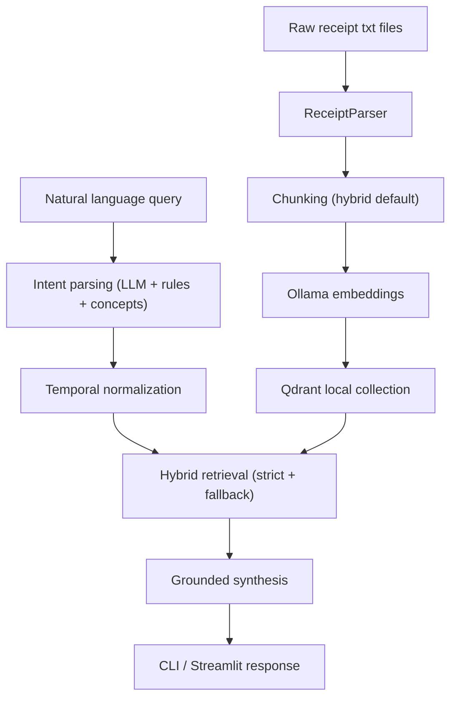

# Receipt Intelligence (Ollama + Qdrant)

Receipt ingestion, indexing, and natural-language query system for the challenge dataset, built locally with Ollama embeddings/chat and Qdrant vector storage.

## Current Status

- End-to-end ingestion, indexing, query, evaluation, and Streamlit UI are implemented.
- Query layer supports deterministic intent routing plus controlled semantic expansion.
- Grounded answer generation and metadata shortcuts are enabled.
- Incremental indexing is enabled through a manifest.

## Quick Start

1. Create and activate a virtual environment.
2. Install dependencies:
   - `pip install -r requirements.txt`
3. Ensure Ollama is running and pull models you use:
   - `ollama pull nomic-embed-text`
   - `ollama pull llama3.1:8b`
4. Copy `.env.example` to `.env`.
5. Ingest and index:
   - `PYTHONPATH=src python scripts/ingest_and_index.py`
6. Run UI:
   - `PYTHONPATH=src streamlit run streamlit_app.py`

## Main Commands

- Ingest/reindex: `PYTHONPATH=src python scripts/ingest_and_index.py`
- CLI query: `PYTHONPATH=src python scripts/query_cli.py`
- Eval scenarios: `PYTHONPATH=src python scripts/eval_queries.py`
- Streamlit UI: `PYTHONPATH=src streamlit run streamlit_app.py`
- Tests: `PYTHONPATH=src ./venv/bin/python -m pytest -q`

## Architecture

1. Parser converts raw receipt text into structured `Receipt` data.
2. Chunker creates receipt/item chunks (default strategy: `hybrid`).
3. Embedder sends chunk text to Ollama for vectors.
4. Vector store upserts vectors + metadata into local Qdrant.
5. Query engine executes:
   - intent extraction (`llm + rule fallback + concept expansion`),
   - temporal normalization,
   - hybrid retrieval (strict filter pass + controlled fallback),
   - grounded synthesis (deterministic by default, optional humanized rewrite).

### Architecture Diagram

## Chunking Strategy (Critical)

Default strategy is `hybrid`:

- `receipt_level` chunk:
  - preserves whole-receipt context (merchant, date, total, item list)
  - strong for aggregation and broad receipt-level questions
- `item_level` chunks:
  - one chunk per line item with receipt metadata
  - strong for item-specific and concept-expansion queries (`item_terms`)
- `hybrid` combines both:
  - higher recall for mixed query types
  - better grounding because aggregation can dedupe at receipt level while still surfacing item evidence

Why this matters:

- receipt-only chunking misses fine-grained item semantics,
- item-only chunking can weaken document-level context and increase aggregation noise,
- hybrid gives best balance for this challenge's query mix.

## Query Coverage Model

### Intent Families

- `core_rule`: deterministic filters and aggregation (merchant, category, date, amount, grouping).
- `semantic_concept`: controlled taxonomy expansion to `item_terms` for fuzzy asks:
  - health-related
  - treats
  - warranty-related
- `metadata_shortcut`: deterministic dataset-level answers:
  - year ranges present
  - earliest/latest date
  - unique merchants/categories (count/list)

These appear in `result.retrieval.intent_family`.

### Temporal Support

- Month windows: `November`, `December`, `January`
- Relative windows: `last week`, `first week of January`, `this week`
- Event windows: `before Christmas`, `Christmas week`, `Thanksgiving week`
- Explicit dates: `MM/DD/YYYY`, `YYYY-MM-DD`
- Ranges: `from X to Y`, `between X and Y`
- Quarter aliases: `Q4 2023`, `Q1 2024`
- Precedence: `range > event > relative > quarter > explicit > month`
- Clipping: normalized ranges clamp to dataset bounds

### Date Ambiguity Policy

- Controlled by:
  - `DATE_PARSE_ORDER` (`mdy` or `dmy`)
  - `DATE_AMBIGUITY_STRATEGY` (`flag`, `prefer_mdy`, `prefer_dmy`, `reject`)
- ISO dates are deterministic.
- Slash-date ambiguity diagnostics are surfaced in parser metadata and `intent.temporal`.

## Retrieval Behavior

Hybrid retrieval in `query/retrieval.py`:

1. Strict vector search with metadata filters.
2. Relaxed fallback search when strict results are sparse.
3. Score fusion, dedupe, receipt/item balancing.

Additional controls:

- For term-heavy concept queries, fallback is suppressed when strict evidence already exists.
- Retrieval metadata includes:
  - `strict_count`, `fallback_count`, `final_count`
  - `used_fallback`
  - `item_terms_count`
  - `evidence_quality` (`strict_only`, `mixed`, `fallback_only`, `none`)

## Answer Synthesis

Grounded synthesis in `query/synthesis.py`:

- Aggregation responses are deterministic, plain-language, and filter-aware.
- Listing responses include applied filter context.
- Concept queries with weak direct lexical evidence return explicit non-speculative messages.
- Optional rewrite layer:
  - `ANSWER_STYLE=hybrid` enables humanized rewrite via Ollama.
  - hard fallback to deterministic answer if rewrite fails.

`QueryResult` includes:

- `answer`
- `answer_mode` (`deterministic` or `humanized`)
- `facts` (grounding payload)
- `intent`
- `retrieval`
- `evidence_rows`

## Incremental Indexing

Manifest-driven indexing avoids full re-embedding every run.

- Manifest path: `INDEX_MANIFEST_PATH` (default `data/index_manifest.json`)
- Workflow:
  - hash source files
  - skip unchanged receipts
  - delete stale points for changed/deleted receipts
  - upsert only changed chunks

## Evaluation

`scripts/eval_queries.py` runs scenario checks and writes `data/eval_results.json`.

Coverage includes:

- core doc-style queries,
- concept probes,
- metadata shortcuts.

Assertions include:

- minimum matched receipts,
- minimum sums,
- expected retrieval mode,
- answer token checks,
- non-empty required intent fields.

## Example Queries And Expected Outputs

These are representative outputs; exact receipt IDs/order may vary by retrieval score.

- Query: `How much did I spend in December 2023?`
  - Expected shape: deterministic aggregation sentence with total spend, receipt count, applied date filter, and example evidence receipts.
- Query: `Find all Whole Foods receipts`
  - Expected shape: listing response with top matching receipts containing merchant and date evidence.
- Query: `List all groceries over $5`
  - Expected shape: listing or aggregation-like result constrained by normalized grocery category + `min_total` filter.
- Query: `Find health-related purchases`
  - Expected shape: concept-routed response using expanded `item_terms` (e.g., pharmacy/medicine/vitamin signals), or explicit "not enough direct item evidence" message if lexical grounding is weak.
- Query: `give me the year ranges that is present in the receipts`
  - Expected shape: metadata shortcut answer (`2023, 2024` plus dataset date bounds), not semantic top-match listing.

## Streamlit UI

`streamlit_app.py` provides:

- Sidebar health + config + ingest/reindex action
- Query tab with answer, metrics, evidence, and debug expanders
- Eval tab with:
  - `Run Evaluation`
  - `Run Coverage Smoke Pack`
  - pass/fail summary + report download

Debug section surfaces `answer_mode`, `facts`, `intent`, and retrieval diagnostics.

## Important Environment Variables

- `RECEIPTS_DIR`
- `PARSED_OUTPUT_PATH`
- `INDEX_MANIFEST_PATH`
- `QDRANT_PATH`
- `QDRANT_COLLECTION`
- `CHUNKING_STRATEGY`
- `OLLAMA_BASE_URL`
- `OLLAMA_EMBEDDING_MODEL`
- `OLLAMA_CHAT_MODEL`
- `OLLAMA_INTENT_TIMEOUT_S`
- `OLLAMA_ANSWER_TIMEOUT_S`
- `RETRIEVAL_K`
- `RETRIEVAL_SPARSE_THRESHOLD`
- `DATE_PARSE_ORDER`
- `DATE_AMBIGUITY_STRATEGY`
- `ANSWER_STYLE`

See `.env.example` for defaults.

## Design Decisions And Trade-offs

- **Hybrid intent routing**
  - Decision: combine LLM extraction with deterministic fallback rules.
  - Trade-off: improved resilience and coverage, with slightly more logic complexity.
- **Hybrid chunking**
  - Decision: keep both receipt- and item-level chunks.
  - Trade-off: higher index size, better retrieval flexibility and grounding.
- **Strict + fallback retrieval**
  - Decision: prefer metadata-filtered strict retrieval, then fallback if sparse.
  - Trade-off: better recall under imperfect parsing, with controlled risk of looser matches.
- **Deterministic-first synthesis**
  - Decision: construct answers from retrieved evidence fields only.
  - Trade-off: safer and auditable outputs, less natural prose unless optional rewrite is enabled.
- **Optional humanized rewrite**
  - Decision: allow Ollama rewrite under `ANSWER_STYLE=hybrid` with deterministic fallback.
  - Trade-off: better readability, but potential style variance; factual grounding preserved via facts payload and fallback behavior.

## Known Limitations

- Semantic concept coverage is controlled and intentionally narrow (not open-world ontology).
- Temporal parser is dataset-oriented, not full natural language calendar comprehension.
- Receipt parsing is robust for current samples but not OCR-grade across arbitrary noisy inputs.
- Evaluation is deterministic and practical, not a full semantic relevance benchmark.

