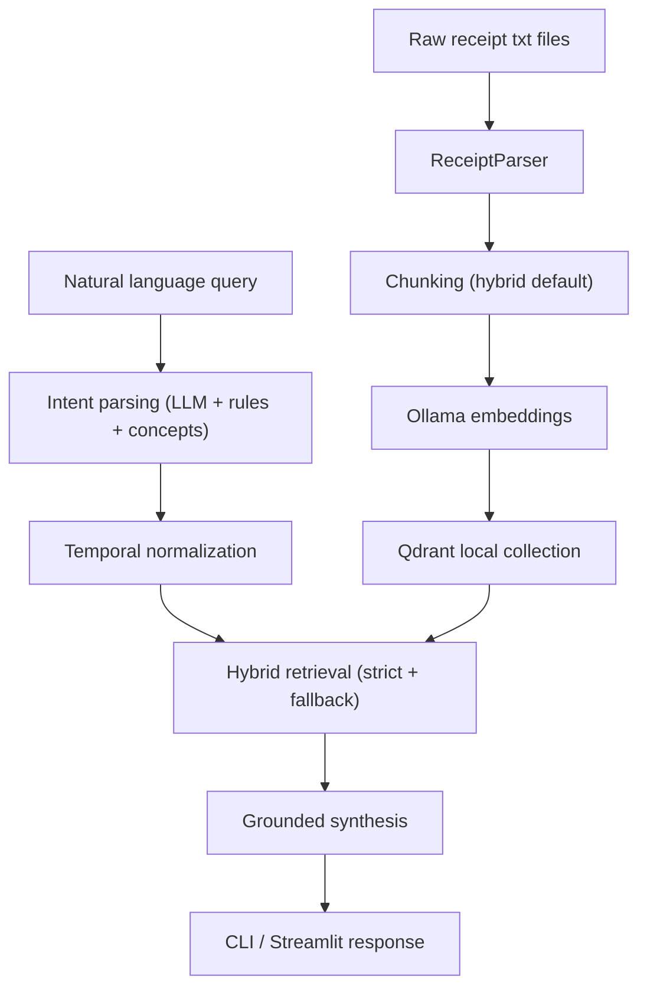

# Receipt Intelligence (Ollama + Qdrant)

Receipt ingestion, indexing, and natural-language query system for the challenge dataset, built locally with Ollama embeddings/chat and Qdrant vector storage.

## Current Status

- End-to-end ingestion, indexing, query, evaluation, and Streamlit UI are implemented.
- Query layer supports deterministic intent routing plus controlled semantic expansion.
- Grounded answer generation and metadata shortcuts are enabled.
- Incremental indexing is enabled through a manifest, with a `--force` flag for full rebuilds.
- Coverage spans the interviewer guide's Tier 1, 2, and 3 query categories (see Query Coverage Matrix).

## Dataset Overview

Challenge dataset at `Notes/receipt_samples_100/`:

- 100 receipts covering Nov 1, 2023 - Jan 31, 2024 (~$8-10K total spend).
- Category mix: 25 grocery, 20 restaurant, 15 coffee, 15 fast food, 8 electronics, 7 pharmacy, 5 retail, 3 hardware, 2 gas.
- Complexity features handled by the pipeline: variable tax rates (8.5-9.25%), restaurant tips (15-22%), extended warranties on electronics, pharmacy pickup / Rx copays, multiple payment methods, and California city locations.

## Quick Start

1. Create and activate a virtual environment.
2. Install dependencies:
   - `pip install -r requirements.txt`
3. Ensure Ollama is running and pull models you use:
   - `ollama pull nomic-embed-text`
   - `ollama pull llama3.1:8b`
4. Copy `.env.example` to `.env`.
5. Ingest and index:
   - `PYTHONPATH=src python scripts/ingest_and_index.py`
   - First-time or after schema changes: `PYTHONPATH=src python scripts/ingest_and_index.py --force`
6. Run UI:
   - `PYTHONPATH=src streamlit run streamlit_app.py`

## Main Commands

- Ingest/reindex: `PYTHONPATH=src python scripts/ingest_and_index.py`
- Full reindex (clears Qdrant collection + manifest): `PYTHONPATH=src python scripts/ingest_and_index.py --force`
- CLI query: `PYTHONPATH=src python scripts/query_cli.py`
- Eval scenarios: `PYTHONPATH=src python scripts/eval_queries.py`
- Streamlit UI: `PYTHONPATH=src streamlit run streamlit_app.py`
- Tests: `PYTHONPATH=src ./venv/bin/python -m pytest -q`

## Architecture

1. Parser converts raw receipt text into structured `Receipt` data (city/state, tip, tax rate, prescription/warranty/loyalty flags).
2. Chunker creates receipt/item chunks (default strategy: `hybrid`) with the full metadata payload.
3. Embedder sends chunk text to Ollama for vectors.
4. Vector store upserts vectors + metadata into local Qdrant.
5. Query engine executes:
   - intent extraction (`llm + rule fallback + concept expansion`),
   - temporal normalization,
   - hybrid retrieval (strict filter pass + controlled fallback),
   - grounded synthesis (deterministic by default, optional humanized rewrite).

### Architecture Diagram

## Chunking Strategy (Critical)

Default strategy is `hybrid`:

- `receipt_level` chunk:
  - preserves whole-receipt context (merchant, date, total, tip, item list, flags)
  - strong for aggregation and broad receipt-level questions
- `item_level` chunks:
  - one chunk per line item with receipt metadata
  - strong for item-specific and concept-expansion queries (`item_terms`)
- `hybrid` combines both:
  - higher recall for mixed query types
  - better grounding because aggregation can dedupe at receipt level while still surfacing item evidence

Why this matters:

- receipt-only chunking misses fine-grained item semantics,
- item-only chunking can weaken document-level context and increase aggregation noise,
- hybrid gives best balance for this challenge's query mix.

## Query Coverage Model

### Intent Families

- `core_rule`: deterministic filters and aggregation (merchant, category, date, amount, grouping, **city**, **payment method**, **tip percentage range**, **per-period rate**).
- `semantic_concept`: controlled taxonomy expansion to `item_terms` for fuzzy asks:
  - health-related
  - treats
  - warranty-related (also sets `require_warranty`)
  - prescription / Rx (also sets `require_prescription` and category=pharmacy)
  - loyalty / rewards (also sets `require_loyalty`)
  - prepared food
- `metadata_shortcut`: deterministic dataset-level answers:
  - year ranges present
  - earliest/latest date
  - unique merchants/categories (count/list)

These appear in `result.retrieval.intent_family`.

### Temporal Support

- Month windows: `November`, `December`, `January`
- Relative windows: `last week`, `first week of January`, `this week`
- Event windows: `before Christmas`, `Christmas week`, `Thanksgiving week`, `week before Christmas`
- Explicit dates: `MM/DD/YYYY`, `YYYY-MM-DD`
- Ranges: `from X to Y`, `between X and Y`
- Quarter aliases: `Q4 2023`, `Q1 2024`
- Precedence: `range > event > relative > quarter > explicit > month`
- Clipping: normalized ranges clamp to dataset bounds

### Date Ambiguity Policy

- Controlled by:
  - `DATE_PARSE_ORDER` (`mdy` or `dmy`)
  - `DATE_AMBIGUITY_STRATEGY` (`flag`, `prefer_mdy`, `prefer_dmy`, `reject`)
- ISO dates are deterministic.
- Slash-date ambiguity diagnostics are surfaced in parser metadata and `intent.temporal`.

## Query Coverage Matrix

Tier 1 (must work perfectly):

- "How much did I spend at Whole Foods?" - supported (`core_rule`: merchant + sum)
- "Show me all coffee purchases" - supported (`core_rule`: category)
- "Find receipts from December 2023" - supported (`core_rule`: temporal month)
- "What's my total spending?" - supported (`core_rule`: sum without filter)

Tier 2 (should work well):

- "Find all receipts over $100" - supported (`core_rule`: min_total)
- "Show me electronics with warranties" - supported (`semantic_concept` warranty + `has_warranty=true` filter)
- "How much did I spend on groceries in December?" - supported (`core_rule`: category + temporal + sum)
- "What restaurants did I tip over 20% at?" - supported (`core_rule`: category=restaurant + min_tip_pct=20)
- "Find all San Francisco receipts" - supported (`core_rule`: city)
- "What's my average grocery bill?" - supported (`core_rule`: category + avg)

Tier 3 (advanced):

- "That expensive electronics purchase from Best Buy" - supported (semantic top-match within merchant+category)
- "Coffee shop with the croissant" - supported (item-level semantic with category)
- "How much do I spend on coffee per week?" - supported (`core_rule`: category + per_period=week, average per bucket)
- "Find receipts from the week before Christmas" - supported (event temporal: 2023-12-18..2023-12-24)
- "Show me all prescriptions I picked up" - supported (`semantic_concept` prescription + `has_prescription=true` filter)

Edge cases:

- "Show me receipts with warranties" - supported (`has_warranty=true`)
- "Find all loyalty discounts" - partial (concept + filter wired; current dataset has no literal loyalty lines so the deterministic answer is graceful "no matching receipts")
- "What did I buy on 11/07/2023?" - supported (explicit date)
- "Show me all returns" - graceful empty (no returns in dataset)

Semantic understanding:

- "Find health-related purchases" - supported (concept: pharmacy/medicine/vitamin/supplement)
- "Show me prepared food purchases" - supported (concept: prepared_food terms)
- "Find all subscriptions" - graceful empty (concept absent)

Multi-constraint:

- "Find all grocery receipts over $50 from Target" - supported
- "Show me restaurant receipts from San Francisco over $50" - supported (category + city + min_total)
- "Electronics from December with warranties" - supported (category + temporal + warranty flag)

Payment-method asks (dataset complexity feature):

- "Show me receipts paid with Visa" - supported (`core_rule`: payment_method=VISA)
- Same for `MASTERCARD`, `AMEX`, `DISCOVER`, `DEBIT`, `CASH`, `APPLE PAY`.

## Retrieval Behavior

Hybrid retrieval in `query/retrieval.py`:

1. Strict vector search with metadata filters.
2. Relaxed fallback search when strict results are sparse.
3. Score fusion, dedupe, receipt/item balancing.

Additional controls:

- For term-heavy concept queries, fallback is suppressed when strict evidence already exists.
- Retrieval metadata includes:
  - `strict_count`, `fallback_count`, `final_count`
  - `used_fallback`
  - `item_terms_count`
  - `evidence_quality` (`strict_only`, `mixed`, `fallback_only`, `none`)

## Answer Synthesis

Grounded synthesis in `query/synthesis.py`:

- Aggregation responses are deterministic, plain-language, and filter-aware.
- Listing responses include applied filter context.
- Per-period rate queries (`per_period=week|month`) emit a dedicated "Average per X" line plus the bucket count and total in `facts.per_period`.
- Tip-threshold queries render `tip_pct` and `tip_amount` per matching receipt.
- Concept queries with weak direct lexical evidence return explicit non-speculative messages.
- Optional rewrite layer:
  - `ANSWER_STYLE=hybrid` enables humanized rewrite via Ollama.
  - hard fallback to deterministic answer if rewrite fails.

`QueryResult` includes:

- `answer`
- `answer_mode` (`deterministic` or `humanized`)
- `facts` (grounding payload, including `per_period` block when applicable)
- `intent`
- `retrieval`
- `evidence_rows` (now also exposes city, state, payment_method, tip_amount, tip_pct, tax_rate, has_prescription, has_warranty, loyalty_flag)

## Incremental Indexing

Manifest-driven indexing avoids full re-embedding every run.

- Manifest path: `INDEX_MANIFEST_PATH` (default `data/index_manifest.json`)
- Workflow:
  - hash source files
  - skip unchanged receipts
  - delete stale points for changed/deleted receipts
  - upsert only changed chunks
- `--force` clears the Qdrant collection and the manifest before running, used after parser/chunk schema changes.

## Evaluation

`scripts/eval_queries.py` runs scenario checks and writes `data/eval_results.json`.

Coverage includes:

- core doc-style queries (merchant, category, date, multi-filter),
- semantic concept probes (health, treats, warranty, prescription, loyalty),
- metadata shortcuts (year coverage),
- new tier-aligned scenarios:
  - `sf_receipts` (city filter)
  - `restaurants_tip_over_20` (tip percentage range)
  - `coffee_per_week` (per-period rate)
  - `week_before_christmas` (event temporal)
  - `prescription_pickup` (concept + flag)
  - `electronics_with_warranty` (concept + flag)
  - `loyalty_discounts` (graceful empty path)
  - `visa_payments` (payment method filter)

Assertions include:

- minimum matched receipts,
- minimum sums,
- expected retrieval mode,
- answer token checks,
- non-empty required intent fields,
- intent field equality (`intent_field_equals`),
- temporal range equality (`temporal_range_eq`),
- facts path non-empty (`facts_path_nonempty`),
- evidence flag presence (`evidence_any_flag`),
- empty-or-contains tolerance for graceful concepts (`allow_empty_or_contains`).

## Example Queries And Expected Outputs

These are representative outputs; exact receipt IDs/order may vary by retrieval score.

- Query: `How much did I spend in December 2023?`
  - Expected shape: deterministic aggregation sentence with total spend, receipt count, applied date filter, and example evidence receipts.
- Query: `Find all Whole Foods receipts`
  - Expected shape: listing response with top matching receipts containing merchant and date evidence.
- Query: `List all groceries over $5`
  - Expected shape: listing or aggregation-like result constrained by normalized grocery category + `min_total` filter.
- Query: `Find health-related purchases`
  - Expected shape: concept-routed response using expanded `item_terms` (e.g., pharmacy/medicine/vitamin signals), or explicit "not enough direct item evidence" message if lexical grounding is weak.
- Query: `give me the year ranges that is present in the receipts`
  - Expected shape: metadata shortcut answer (`2023, 2024` plus dataset date bounds), not semantic top-match listing.
- Query: `Find all San Francisco receipts`
  - Expected shape: listing with applied `city=san francisco` filter.
- Query: `What restaurants did I tip over 20% at?`
  - Expected shape: listing with category=restaurant and tip_pct >= 20, each row showing tip percent and amount.
- Query: `How much do I spend on coffee per week?`
  - Expected shape: aggregation with average per week line plus bucket count and total in `facts.per_period`.
- Query: `Find receipts from the week before Christmas`
  - Expected shape: listing/aggregation constrained to 2023-12-18..2023-12-24 (event temporal source).
- Query: `Show me all prescriptions I picked up`
  - Expected shape: pharmacy receipts with `has_prescription=true` and Rx items in evidence.

## Streamlit UI

`streamlit_app.py` provides:

- Sidebar health + config + ingest/reindex action
- Query tab with answer, metrics, evidence, and debug expanders
- Eval tab with:
  - `Run Evaluation`
  - `Run Coverage Smoke Pack`
  - pass/fail summary + report download

Debug section surfaces `answer_mode`, `facts`, `intent`, and retrieval diagnostics.

## Important Environment Variables

- `RECEIPTS_DIR`
- `PARSED_OUTPUT_PATH`
- `INDEX_MANIFEST_PATH`
- `QDRANT_PATH`
- `QDRANT_COLLECTION`
- `CHUNKING_STRATEGY`
- `OLLAMA_BASE_URL`
- `OLLAMA_EMBEDDING_MODEL`
- `OLLAMA_CHAT_MODEL`
- `OLLAMA_INTENT_TIMEOUT_S`
- `OLLAMA_ANSWER_TIMEOUT_S`
- `RETRIEVAL_K`
- `RETRIEVAL_SPARSE_THRESHOLD`
- `DATE_PARSE_ORDER`
- `DATE_AMBIGUITY_STRATEGY`
- `ANSWER_STYLE`

See `.env.example` for defaults.

## Design Rationale

- **Ollama + Qdrant vs OpenAI + Pinecone.** The reference description suggested OpenAI embeddings and Pinecone. We chose locally-hosted alternatives (`nomic-embed-text` via Ollama for embeddings, on-disk Qdrant for vector storage) for three reasons: zero per-query cost during iteration, no vendor lock-in or network dependency, and the ability to demo the full system on a laptop without provisioning external accounts. The retrieval/intent/synthesis layers are model-agnostic and would swap to OpenAI+Pinecone behind the same `QdrantStore` and `OllamaEmbedder` interfaces.
- **Deterministic-first synthesis.** Aggregations and listings are constructed from grounded `facts` and evidence rows rather than free-form LLM generation. This eliminates hallucinated totals or merchant names. A humanized rewrite layer (`ANSWER_STYLE=hybrid`) is opt-in and falls back to the deterministic answer if the rewrite fails.
- **Hybrid chunking with rich metadata.** Both receipt-level and item-level chunks are indexed with the same metadata payload. This lets the same Qdrant collection serve aggregation (dedupe at receipt level) and item search (item terms + content text match) without separate indexes.

## Scaling Notes

- **Batch embedding.** Document ingestion sends all changed-chunk texts to Ollama in one call (`embed_documents`); for very large datasets this can be split into bounded batches without changing the rest of the pipeline.
- **Incremental manifest.** `data/index_manifest.json` records source-file SHA1s; unchanged receipts skip re-embedding. Stale chunks are explicitly deleted from Qdrant before upsert.
- **Payload-indexed fields.** Filterable keys (category, merchant, date, city, payment_method, tip_pct, has_warranty, has_prescription, loyalty_flag, total_amount) are flat scalars to keep filter latency O(N) over a small payload index. For >100K vectors, Qdrant's payload indexes (`create_payload_index`) on the high-cardinality keys (`merchant`, `date`, `city`) would be added.
- **Caching.** Intent parsing for repeated queries is the cheapest cache opportunity; deterministic facts can also be memoized when filters are identical.
- **Strict-then-fallback retrieval.** Reduces wasted vector scans when metadata filters already produce dense evidence.

## Production Readiness

Not part of the challenge but called out for honesty:

- **Receipt OCR ingestion.** Current parser assumes pre-cleaned text; a production system would gate on a vision OCR step (Tesseract / cloud OCR) with confidence thresholds.
- **Multi-user / privacy.** Add per-user namespace on Qdrant collection or per-user filter key; secret management via vault rather than `.env`.
- **Monitoring.** Track ingestion lag, retrieval latency, fallback ratio, empty-result ratio per intent family, and Ollama timeouts.
- **Export / reporting.** `evidence_rows` is already structured for CSV/Parquet export; a small adapter would expose monthly summaries.
- **Structured category taxonomy.** Replace stem-derived category with a learned classifier or merchant->category lookup table.
- **Feedback loop.** Allow users to flag bad results; weight feedback into a re-ranker on top of strict+fallback.
- **API surface.** Wrap `QueryEngine.query` in a thin FastAPI service; rate-limit per user.

## Design Decisions And Trade-offs

- **Hybrid intent routing**
  - Decision: combine LLM extraction with deterministic fallback rules.
  - Trade-off: improved resilience and coverage, with slightly more logic complexity.
- **Hybrid chunking**
  - Decision: keep both receipt- and item-level chunks.
  - Trade-off: higher index size, better retrieval flexibility and grounding.
- **Strict + fallback retrieval**
  - Decision: prefer metadata-filtered strict retrieval, then fallback if sparse.
  - Trade-off: better recall under imperfect parsing, with controlled risk of looser matches.
- **Deterministic-first synthesis**
  - Decision: construct answers from retrieved evidence fields only.
  - Trade-off: safer and auditable outputs, less natural prose unless optional rewrite is enabled.
- **Optional humanized rewrite**
  - Decision: allow Ollama rewrite under `ANSWER_STYLE=hybrid` with deterministic fallback.
  - Trade-off: better readability, but potential style variance; factual grounding preserved via facts payload and fallback behavior.

## Known Limitations

- Semantic concept coverage is controlled and intentionally narrow (not open-world ontology).
- Temporal parser is dataset-oriented, not full natural language calendar comprehension.
- Receipt parsing is robust for current samples but not OCR-grade across arbitrary noisy inputs.
- Evaluation is deterministic and practical, not a full semantic relevance benchmark.
- **Loyalty discounts**: the `loyalty` concept and `loyalty_flag` filter are wired end-to-end, but the current dataset's receipt text files do not contain literal "loyalty"/"RedCard"/"member savings" lines (only the dataset README claims this complexity feature). As a result, "Find all loyalty discounts" returns a graceful "no matching receipts" answer on this corpus. The pipeline will surface real loyalty receipts immediately when the source text contains those markers.
- **Tax rate variance**: the parser captures `tax_rate` per receipt (e.g., 8.5%, 9.2%) and chunks expose it for filtering, but natural-language routing for queries like "receipts taxed at 9.25%" is not currently implemented; such queries would need a small intent extractor addition.
- **Prescription/warranty flag dependency**: `has_prescription` and `has_warranty` rely on the dataset's specific markers (`*** PHARMACY PICKUP ***`, `RX#`, `EXTENDED WARRANTY`); other phrasings would need new marker strings.
